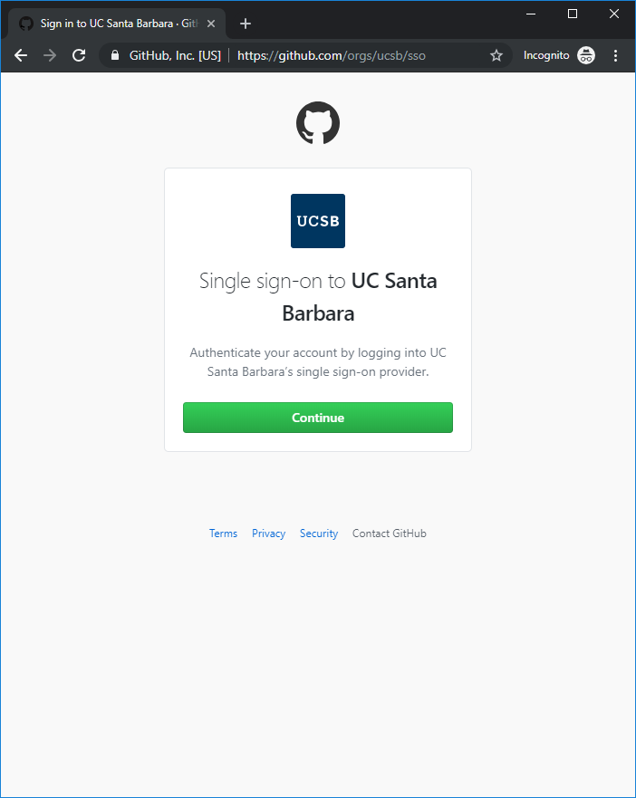

# UCSB Github Guide

#### Get Started 

 1. Create a free account (https://help.github.com/en/articles/types-of-github-accounts#personal-user-accounts) at GitHub.com.
 1. Join the UCSB github orgnization.
    * Single sign-on link to [https://github.com/orgs/ucsb/sso](https://github.com/orgs/ucsb/sso)
        
    * Then Sign in via the UCSB SSO Portal using your UCSBnetID
        
    * This will link your GitHub.com account with your UCSB organization account.  If you haven't yet logged into GitHub.com, you will be prompted to login to GitHub at this step.
1. How to access the UCSB organization - https://help.github.com/en/articles/accessing-an-organization  
   
GitHub is a service provided under the auspices of the [Office of the CIO](https://cio.ucsb.edu/).

#### About GitHub

GitHub is a Web-based Git repository hosting service. The largest code hosting system in the world with over 28.8 million repositories including the Linux kernel and the C++ programming language, it offers all of the distributed revision control and source code management (SCM) functionality of Git as well as adding its own features.

https://github.com/features

The UC Santa Barbara GitHub organization enables private repositories (accessible only to the owners of that repo), advanced team functionality, and other enterprise features. The UC Santa Barbara GitHub organization is currently being used for a wide range of purposes including research projects, campus-wide business applications, and hosted websites.

Features/Benefits: 

 * Source code management
 * Integrated issue tracking
 * Collaborative code review
 * Teams for collaboration, including “secret” teams
 * Private repositories
 * Repository wikis
 * Organization and project hosted webpages on GitHub Pages
 * Source code (text) snippets with Gists

#### Terms of Use

